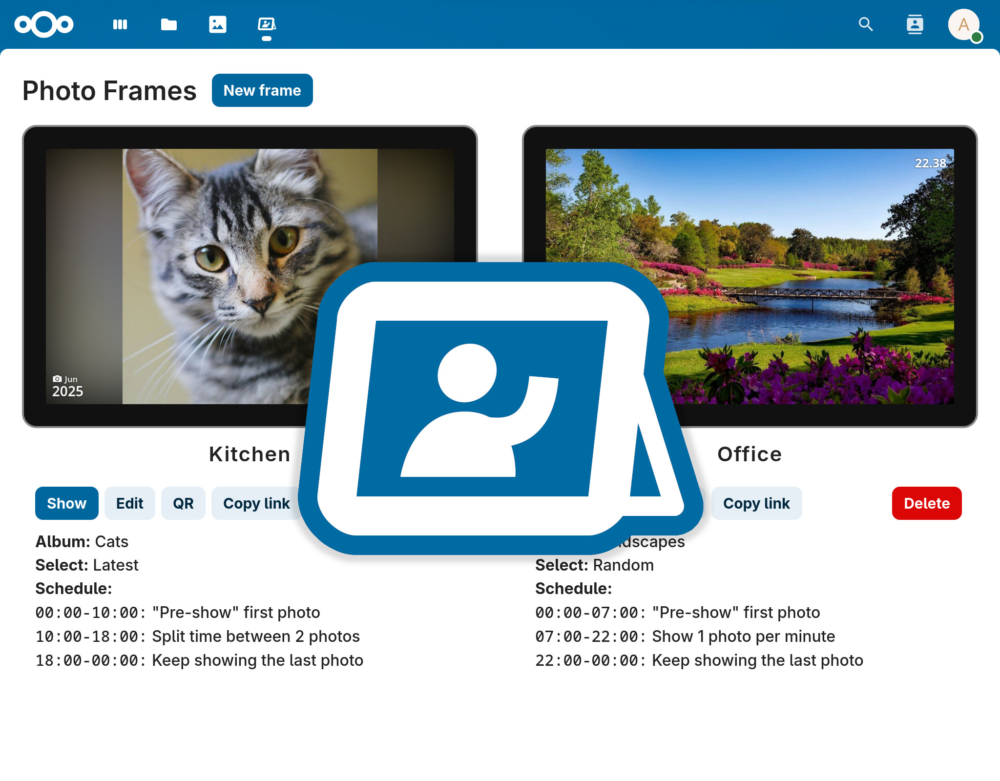

# Photo Frames

Generate easily sharable photo frame URLs for your Nextcloud albums.

The possiblities are endless:

- Turn any android device into a smart photo frame (with the help of a kiosk browser)
- Co-create photo frames with Nextcloud's collaborative albums
- Share photo frames across households
